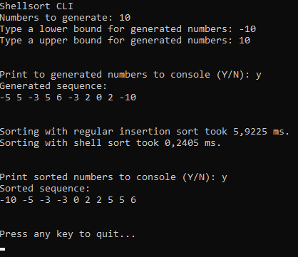

# Shellsort Algorithm 
This project implements the Shellsort algorithm as command line interface (CLI).

> Shellsort, also known as Shell sort or Shell's method, is an in-place comparison sort. It can be seen as either a generalization of sorting by exchange (bubble sort) or sorting by insertion (insertion sort).[3] The method starts by sorting pairs of elements far apart from each other, then progressively reducing the gap between elements to be compared. By starting with far apart elements, it can move some out-of-place elements into position faster than a simple nearest neighbor exchange.

[Wikipedia](https://en.wikipedia.org/wiki/Shellsort)
# Screenshot

# License
````
MIT License

Copyright (c) 2020 Joba

Permission is hereby granted, free of charge, to any person obtaining a copy
of this software and associated documentation files (the "Software"), to deal
in the Software without restriction, including without limitation the rights
to use, copy, modify, merge, publish, distribute, sublicense, and/or sell
copies of the Software, and to permit persons to whom the Software is
furnished to do so, subject to the following conditions:

The above copyright notice and this permission notice shall be included in all
copies or substantial portions of the Software.

THE SOFTWARE IS PROVIDED "AS IS", WITHOUT WARRANTY OF ANY KIND, EXPRESS OR
IMPLIED, INCLUDING BUT NOT LIMITED TO THE WARRANTIES OF MERCHANTABILITY,
FITNESS FOR A PARTICULAR PURPOSE AND NONINFRINGEMENT. IN NO EVENT SHALL THE
AUTHORS OR COPYRIGHT HOLDERS BE LIABLE FOR ANY CLAIM, DAMAGES OR OTHER
LIABILITY, WHETHER IN AN ACTION OF CONTRACT, TORT OR OTHERWISE, ARISING FROM,
OUT OF OR IN CONNECTION WITH THE SOFTWARE OR THE USE OR OTHER DEALINGS IN THE
SOFTWARE.
````
